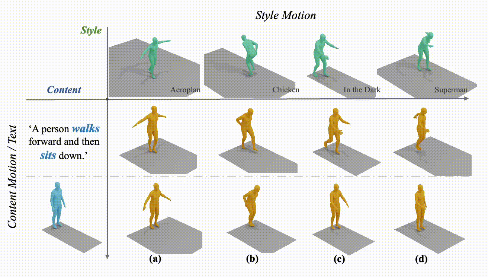

# SMooDi: Stylized Motion Diffusion Model
### [Project Page](https://neu-vi.github.io/SMooDi/) | [Paper](https://arxiv.org/pdf/2407.12783)

> SMooDi: Stylized Motion Diffusion Model  
> [Lei Zhong](https://zhongleilz.github.io/), [Yiming Xie](https://ymingxie.github.io), [Varun Jampani](https://varunjampani.github.io/), [Deqing Sun](https://deqings.github.io/), [Huaizu Jiang](https://jianghz.me/)    



## Citation
If you find our code or paper helpful, please consider starring our repository and citing:
```bibtex
@article{zhong2024smoodi,
      title={SMooDi: Stylized Motion Diffusion Model},
      author={Zhong, Lei and Xie, Yiming and Jampani, Varun and Sun, Deqing and Jiang, Huaizu},
      journal={arXiv preprint arXiv:2407.12783},
      year={2024}
}
```

## TODO List
- [x] Release retargeted 100STYLE dataset.
- [x] Code for Inference and Pretrained model.
- [ ] Evaluation code and metrics.
- [ ] Code for training.

## Retargeted 100STYLE Dataset
We have released the retargeted 100STYLE dataset, mapped to the SMPL skeleton, available on [Google Drive](https://drive.google.com/drive/folders/1P_aQdSuiht3gh1kjGkK4KBt_9i9ARawy?usp=drive_link).

### Processing Steps for the 100STYLE Dataset:
1. **Retargeting with Rokoko**: We used Rokoko to retarget 100STYLE motions to the SMPL skeleton template in BVH format. You can refer to this [Video Tutorial](https://www.youtube.com/watch?v=Nyxeb48mUfs) for a detailed guide on using Rokoko.

2. **Extracting 3D Joint Positions**: After obtaining the retargeted 100STYLE dataset in BVH format, we utilized [CharacterAnimationTools](https://github.com/KosukeFukazawa/CharacterAnimationTools) to extract 3D joint positions.

3. **Deriving HumanML3D Features**: Following the extraction, we used the instructions in the `motion_representation.ipynb` notebook available in [HumanML3D](https://github.com/EricGuo5513/HumanML3D) to derive the HumanML3D features.

## PRETRAINED_WEIGHTS
Available on [Google Drive](https://drive.google.com/drive/folders/12m_v_vybVeAQFkH9bP8wmJIxJhGoIJL1?usp=sharing).

## Acknowledgments

Our code is based on [MLD](https://github.com/ChenFengYe/motion-latent-diffusion).  
The motion visualization is based on [MLD](https://github.com/ChenFengYe/motion-latent-diffusion) and [TMOS](https://github.com/Mathux/TEMOS). 
We also thank the following works:
[guided-diffusion](https://github.com/openai/guided-diffusion), [MotionCLIP](https://github.com/GuyTevet/MotionCLIP), [text-to-motion](https://github.com/EricGuo5513/text-to-motion), [actor](https://github.com/Mathux/ACTOR), [joints2smpl](https://github.com/wangsen1312/joints2smpl), [MoDi](https://github.com/sigal-raab/MoDi), [HumanML3D](https://github.com/EricGuo5513/HumanML3D) [OmniControl](https://github.com/neu-vi/OmniControl).

## License
This code is distributed under an [MIT LICENSE](LICENSE).  

Note that our code depends on several other libraries, including SMPL, SMPL-X, and PyTorch3D, and utilizes the HumanML3D and 100STYLE datasets. Each of these has its own respective license that must also be adhered to.
